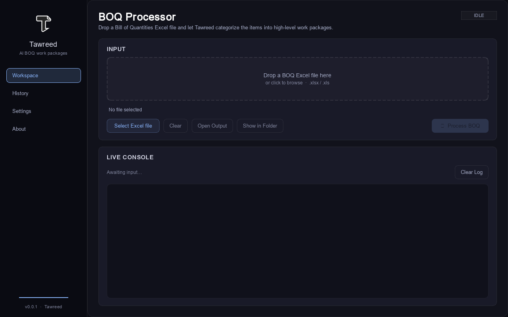
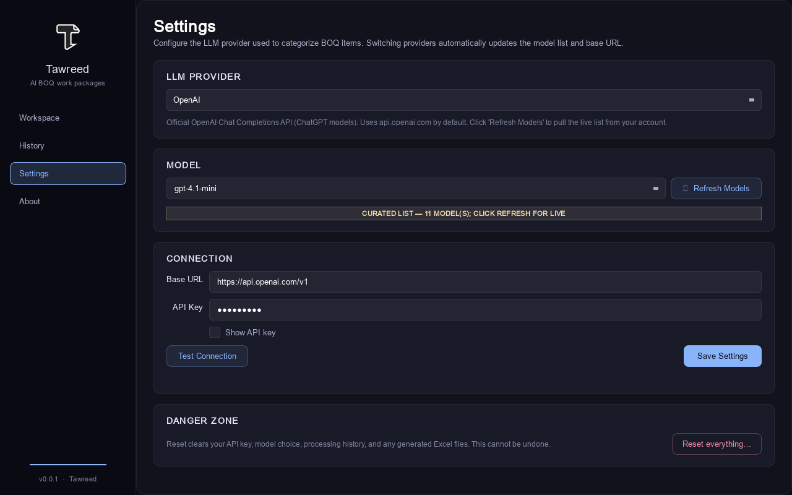

# Tawreed

> AI-driven BOQ work-package extraction for construction QSs.

Tawreed takes a Bill of Quantities (BOQ) Excel — Arabic or English, one
sheet or seven — and re-emits it as a structured work-package workbook
ready to hand to procurement. Categorisation is done by a large language
model (OpenAI, Anthropic Claude, Google Gemini, any OpenAI-compatible
endpoint, or the optional Codex CLI adapter), and the output Excel is Calibri-formatted, currency-aware,
and aligned to the way a quantity surveyor actually reads the file.

## Architecture

See [ARCHITECTURE.md](docs/ARCHITECTURE.md) for a detailed overview of
Tawreed's modular design, component interactions, and key design
principles.

## Features

- **Complete i18n Support**: All application pages (Workspace, History, Settings, About) support bilingual English/Arabic UI with automatic RTL layout switching
- **Language Toggle**: English ↔ Arabic language switcher with automatic UI translation
- **Dark/Light Theme Toggle**: Theme selection with professional dark and light themes
- **Recent Files List**: List of recently opened BOQ files with click-to-open functionality
- **Progress Bar**: Visual progress indicator during BOQ processing
- **Toast Notifications**: Non-blocking success/error feedback
- **Keyboard Shortcuts**: Common actions accessible via keyboard (Esc, Ctrl+O, Ctrl+P, Ctrl+L)
- **Memory Optimization**: Efficient handling of large Excel files (>10MB)
- **Mandatory Human Review**: Every proposed package can be checked and edited before any Excel or history record is created
- **Bounded AI Agent**: Large BOQs are sent as size-limited JSON batches with exact item-ID reconciliation and no model file or shell tools
- **Optional Codex Login**: Experimental Codex CLI provider can reuse an existing `codex login` session and ChatGPT plan/credits without copying the token into Tawreed
- **Enhanced Error Handling**: Clear, actionable error messages for common issues
- **Comprehensive Testing**: 273 automated tests plus clean-wheel and packaged-app smoke checks
- **Professional Excel Output**: Calibri-formatted, currency-aware workbooks with formulas

### Workspace



### Settings



## Install

### From a release (recommended)

Download the asset for your platform from the
[Releases page](https://github.com/sfkareem/tawreed/releases) and
double-click to run:

| File | Platform | Notes |
|------|----------|-------|
| `Tawreed-windows.exe` | Windows 10/11 (64-bit) | single-file, ~41 MB |
| `Tawreed-macos`       | macOS 11+ (Apple Silicon + Intel) | single-file, ~44 MB |
| `Tawreed-linux`       | Linux x86_64 (glibc 2.31+) | single-file, ~90 MB |

> **Windows SmartScreen**: the EXE is unsigned, so SmartScreen will
> show "Windows protected your PC". Click **More info** → **Run
> anyway** to proceed. See [docs/INSTALL.md](docs/INSTALL.md) for
> the full per-platform notes.
>
> **macOS Gatekeeper**: right-click the binary the first time and
> choose **Open** to bypass the unidentified-developer warning.

### From source (development)

```bash
git clone https://github.com/sfkareem/tawreed
cd tawreed
python -m venv .venv
. .venv/Scripts/activate      # Windows
# . .venv/bin/activate        # macOS / Linux
pip install -e ".[dev]"
```

## Run

```bash
python main.py
```

This launches the desktop application. On first run, Tawreed will:

1. Create `~/.tawreed/` and initialise the SQLite database.
2. Show a splash screen.
3. Reveal the Workspace page, where you can drop in a BOQ Excel
   and click **Process**.
4. Show a mandatory review table. Edit any proposed work package,
   then click **Approve & Export** to create the workbook.

To try the optional Codex provider, install the official Codex CLI,
run `codex login`, then choose **Codex (ChatGPT login) — Experimental**
in Settings. If the CLI or login is unavailable, Tawreed reports that
state and does not silently switch providers.

## Build

PyInstaller onefile build for the current platform:

```bash
.venv/Scripts/pyinstaller tawreed.spec    # Windows
.venv/bin/pyinstaller tawreed.spec        # macOS / Linux
```

Output: `dist/Tawreed.exe` (Windows) or `dist/Tawreed` (macOS /
Linux) — a single binary, no folder of DLLs to ship.

## State location

All per-user state lives under `~/.tawreed/`. **No data is written
to the Windows Registry, `%APPDATA%`, the EXE directory, or any
location outside your home folder.** See [SECURITY.md](SECURITY.md)
for the full disclosure policy.

| Path                              | Purpose                                                |
|-----------------------------------|--------------------------------------------------------|
| `~/.tawreed/config.json`          | User settings: provider, model, base URL (no secrets)  |
| `~/.tawreed/ui_state.json`        | Window geometry + last visited page                    |
| `~/.tawreed/db/tawreed.db`        | Processing history (SQLite)                            |
| `~/.tawreed/outputs/`             | Generated work-package Excel files                     |
| `~/.tawreed/logs/`                | Rotating log files (`tawreed.log`, +`.1`, +`.2`, +`.3`) |
| `~/.tawreed/single-instance.pid`  | PID file for single-instance handshake                 |
| `~/.tawreed/.secret_fallback`     | ONLY present when the OS keyring is unavailable        |

API keys are stored in the **OS credential store** (Windows
Credential Manager, macOS Keychain, or Linux libsecret via the
`keyring` Python package) — never on disk in plaintext.

On Windows, `~` resolves to `%USERPROFILE%`, so the actual path is
`C:\Users\<you>\.tawreed\`.

## Project structure

```
tawreed/
├── main.py                  # Entry point (qasync + PySide6)
├── tawreed.spec             # PyInstaller onedir spec
├── pyproject.toml           # Build + metadata
├── core/                    # Backend (no Qt)
│   ├── ai.py                # Multi-provider streaming client
│   ├── codex_connector.py   # Optional least-privilege Codex CLI adapter
│   ├── db.py                # SQLite state at ~/.tawreed/
│   ├── excel.py             # openpyxl parse + Calibri write
│   ├── logging_setup.py     # RotatingFileHandler config
│   ├── model_catalog.py     # Provider / model catalog
│   ├── packaging_agent.py   # Review-before-export state + batching policy
│   └── reset.py             # Settings reset
├── gui/                     # Qt / PySide6
│   ├── main_window.py       # QStackedWidget nav shell
│   ├── review_dialog.py     # Mandatory editable package review
│   ├── single_app.py        # Single-instance via QLocalServer
│   ├── splash.py            # QSplashScreen
│   ├── pages/               # Workspace, History, Settings, About
│   ├── widgets/             # Shared chrome (Card, Section)
│   └── themes/              # .qss theme files
├── tawreed_app/             # Console entry point (python -m tawreed)
├── tests/                   # pytest suite + end-to-end workflow tests
└── _scripts/                # Local build helpers (not in the wheel)
```

## License

[MIT](LICENSE) © 2026 Kareem Safwat.

## Author

[Kareem Safwat](https://kareemsafwat.com) — solo developer, MENA
construction-tech.

## Acknowledgments

Built with [PySide6](https://wiki.qt.io/Qt_for_Python) (LGPL),
[qasync](https://github.com/CabbageDevelopment/qasync) (BSD),
[openai](https://github.com/openai/openai-python) (Apache-2.0),
[openpyxl](https://foss.heptapod.net/openpyxl/openpyxl) (MIT),
[httpx](https://github.com/encode/httpx) (BSD).

## Contributing

See [CONTRIBUTING.md](CONTRIBUTING.md). PRs are squash-merged.
